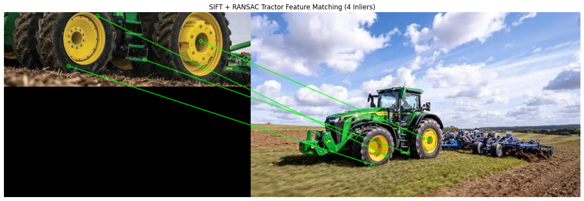
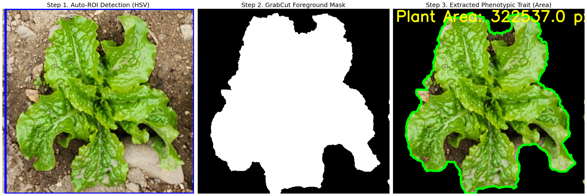

# 🌱 Plant Phenotyping & Computer Vision Basics

A foundational computer vision practice repository for agricultural data analysis and plant phenotyping research.

  
  
  
  

 

## 📌 Overview
This repository records and tests image processing techniques applicable to real-world agricultural environments, such as smart farms and autonomous agricultural machinery. It is built upon the core algorithms covered in the undergraduate course "Plant Phenotyping and Imaging."

## 🛠 Contents (To-Do)
- [x] **Tractor Object Matching:** Object detection testing for autonomous agricultural machinery (e.g., John Deere) using SIFT & RANSAC algorithms.
- [x] **Leaf Area Segmentation:** Crop leaf segmentation and area extraction in complex backgrounds using the GrabCut algorithm.
- [x] **Image Preprocessing:** Image preprocessing for irregular lighting correction in greenhouse and open-field environments (Gaussian Blur, Gamma Correction).

---

## 📝 Project 01: Robust Tractor Recognition using SIFT & RANSAC

In agricultural environments, recognizing specific machinery or plant structures is highly challenging due to dynamic background noise, varying scales, and different viewpoints. 

This project demonstrates how to reliably detect and match a 3D object (a John Deere 8R 410 tractor) across different field images by extracting localized features and mathematically filtering out false matches.

### 🔍 Methodology

1. **ROI Extraction (Cropping)**
   - **Why?** Real-world agricultural images contain immense background noise (skies, fields, structures). By cropping the model image to a specific Region of Interest (ROI) containing the tractor, we prevent the algorithm from extracting features from irrelevant backgrounds, drastically increasing matching accuracy.
   
2. **Keypoint Detection (SIFT)**
   - Utilized the **Scale-Invariant Feature Transform (SIFT)** algorithm to extract keypoints and 128-dimensional descriptors. SIFT ensures that the tractor's features (such as the grill pattern and logos) are recognized regardless of image scale or rotation differences.

3. **Feature Matching (FLANN & Ratio Test)**
   - Employed a **FLANN-based KD-Tree matcher** for fast approximate nearest neighbor searches.
   - Applied **Lowe's Ratio Test** (Threshold = 0.7) to eliminate ambiguous or poorly matched putative correspondences.

4. **Geometric Verification (RANSAC)**
   - Since initial matches often contain false positives (outliers), the **RANSAC (Random Sample Consensus)** algorithm was applied to estimate a spatial transformation model (Homography). RANSAC robustly discards geometrically incorrect matches, leaving only highly reliable inliers.

### 🚀 Results
* **Model Keypoints:** Successfully extracted from the cropped ROI.
* **Scene Keypoints:** Extracted from the full, complex field environment.
* **RANSAC Inliers:** The final output demonstrates highly accurate mapping between the cropped model features and the target scene, completely ignoring background artifacts like clouds or soil.

 

  

---

## 📝 Project 02: Automated Leaf Area Segmentation & Phenotypic Trait Extraction

In precision agriculture, non-destructive estimation of plant canopy area is crucial for monitoring growth and health. This project focuses on automatically segmenting a target crop (lettuce) from an open-field soil background and computationally extracting its phenotypic traits.

### 🔍 Methodology

1. **Automated ROI Detection (HSV Color Space)**
   * **Challenge:** Manually defining bounding boxes for thousands of crop images is highly inefficient for real-world farming applications.
   * **Approach:** Applied an HSV color space mask to automatically detect green vegetation. The algorithm calculates the bounding box of the largest connected green component, establishing an automated Region of Interest (Auto-ROI).
   
2. **Foreground Segmentation (GrabCut Algorithm)**
   * Utilized the Graph-Cut based **GrabCut** algorithm initialized with the Auto-ROI. 
   * GrabCut models the color distributions of the foreground (lettuce) and background (soil, rocks) using Gaussian Mixture Models (GMMs), iteratively refining the mask to perfectly isolate the plant from complex noise.

3. **Phenotypic Trait Extraction (Contour & Area)**
   * Extracted the external boundaries (`cv2.findContours`) from the binary segmentation mask.
   * Computed the total pixel area using image moments (`cv2.contourArea`), providing a quantifiable metric for plant canopy size.

### 🚀 Results
* **Robust Segmentation:** Successfully separated the complex open-field background (soil and stones) from the target lettuce plant without any manual coordinate inputs.
* **Automated Phenotyping:** The pipeline successfully output the plant's surface area (e.g., 322,537 px), demonstrating a scalable and highly accurate approach for high-throughput crop monitoring.

 

  

---

## 📝 Project 03: Image Preprocessing for Irregular Lighting Correction

In real-world agricultural environments (greenhouses and open fields), computer vision systems frequently struggle with severe illumination variations, harsh shadows, and sensor noise. This project implements essential image preprocessing techniques to standardize image quality before feeding it into complex phenotyping or detection models.

### 🔍 Methodology

1. **Noise Reduction (Gaussian Blur)**
   * **Why?** Agricultural images often contain high-frequency noise from dust, sensor artifacts, or complex textures.
   * **Approach:** Applied a `5x5` Gaussian filter (`cv2.GaussianBlur`) to intelligently smooth the image while preserving vital crop boundary features.
   
2. **Illumination Normalization (Gamma Correction)**
   * **Why?** Direct sunlight creates overexposed areas, while overlapping canopies create deep, underexposed shadows, causing segmentation algorithms to fail.
   * **Approach:** Implemented a non-linear Gamma Correction function ($V_{out} = V_{in}^{\gamma}$). 
   * By adjusting the gamma value ($\gamma < 1$ to brighten shadows, $\gamma > 1$ to darken highlights), the dynamic range of the crop image is balanced without completely washing out the colors.

### 🚀 Results
* **Enhanced Visibility:** Successfully recovered leaf details hidden in deep canopy shadows using $\gamma = 0.5$.
* **Robust Foundation:** The preprocessed images showed a significantly smoother and more uniform color distribution, drastically improving the reliability of downstream tasks like SIFT matching or GrabCut segmentation.

 

  

